# 產品銷售應用

> 本文件由 SDLC Agentic Platform 於**業務需求與技術需求皆經人工確認後**自動產出/更新(application type:JAVA_BACKEND_SIT);測試案例階段確認後會再補入技術層級測試情境。

## 1. 分析方法與流程

本專案的架構文件依循以下推導鏈,每一步的產物都是下一步的輸入:

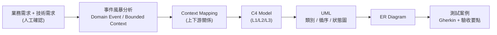

- **事件風暴**:從業務輸入(白板/看板/文件)辨識 domain event(領域中已發生的事實)、command(觸發動作)、actor、policy、外部系統,依便利貼顏色語彙分類、依空間分佈分群出 bounded context。
- **Context Mapping**:以事件流方向排出 context 間的上下游(U→D)關係,並標註與外部系統的整合點。
- **C4 / UML / ER**:由上述分析**機械式推導**——類別=aggregate、方法=command、循序=command→event、狀態=事件序、ER=aggregate 與實體。

## 2. 事件風暴分析(Event Storming)

> 來源:photo;顏色語彙依 eventstorming.com——🟧 Domain Event(過去式事實)、🟦 Command、🟨 Actor/Aggregate、🟪 Policy(每當…則…)、🩷 外部系統、🟥 Hotspot(待釐清)。

辨識出 **3 個 bounded context**、12 個 domain event。

### 2.1 Bounded Context:商品數量

| 元素 | 內容 |
|---|---|
| 🟧 Domain Events | 商品數量已查詢、商品數量已回覆、庫存數量已取得 |
| 🟦 Commands | 扣款 |
| 🩷 External Systems | 外部系統 信用卡金流閘道 |

### 2.2 Bounded Context:採購

| 元素 | 內容 |
|---|---|
| 🟧 Domain Events | 採購已請求、金額已預估、庫存已確認可賣、款項已扣款、採購已完成 |
| 🟦 Commands | 下單採購、預估金額、確認庫存 |
| 🟪 Policies | Policy 可賣則扣款 |

### 2.3 Bounded Context:退貨

| 元素 | 內容 |
|---|---|
| 🟧 Domain Events | 退貨已請求、信用卡已退款、退貨庫存已增加、退貨已完成 |
| 🟨 Actors | 消費者 Customer |
| 🟪 Policies | Policy 預估優先、Policy 預估成功驗庫存 |

### 事件流(時間軸)

依白板/看板的空間順序還原的完整事件流:

`商品數量已查詢` → `商品數量已回覆` → `庫存數量已取得` → `採購已請求` → `金額已預估` → `庫存已確認可賣` → `款項已扣款` → `採購已完成` → `退貨已請求` → `信用卡已退款` → `退貨庫存已增加` → `退貨已完成`

## 3. Context Mapping

**說明**:依事件流方向,上游(U)context 的 domain event 驅動下游(D)context 的行為;與外部系統的整合建議以防腐層(ACL)隔離,避免外部模型滲入領域。

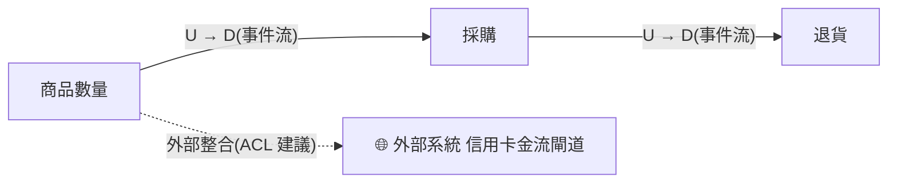

| 上游(U) | 下游(D) | 關係依據 |
|---|---|---|
| 商品數量 | 採購 | 事件「庫存數量已取得」觸發下游流程 |
| 採購 | 退貨 | 事件「採購已完成」觸發下游流程 |
| 商品數量 | 外部系統 信用卡金流閘道(外部) | 外部整合點,建議 ACL |

## 4. C4 Model

### L1 系統情境圖(System Context)

**說明**:系統與使用者、外部系統的邊界——誰在用、依賴誰。actor 與外部系統取自事件風暴的 🟨/🩷 便利貼。

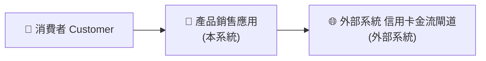

### L2 容器圖(Container)

**說明**:系統內部的可部署單元與資料流;採技術需求確認的三層式架構(Web/API → 應用服務 → 資料庫),外部系統經應用服務層整合。

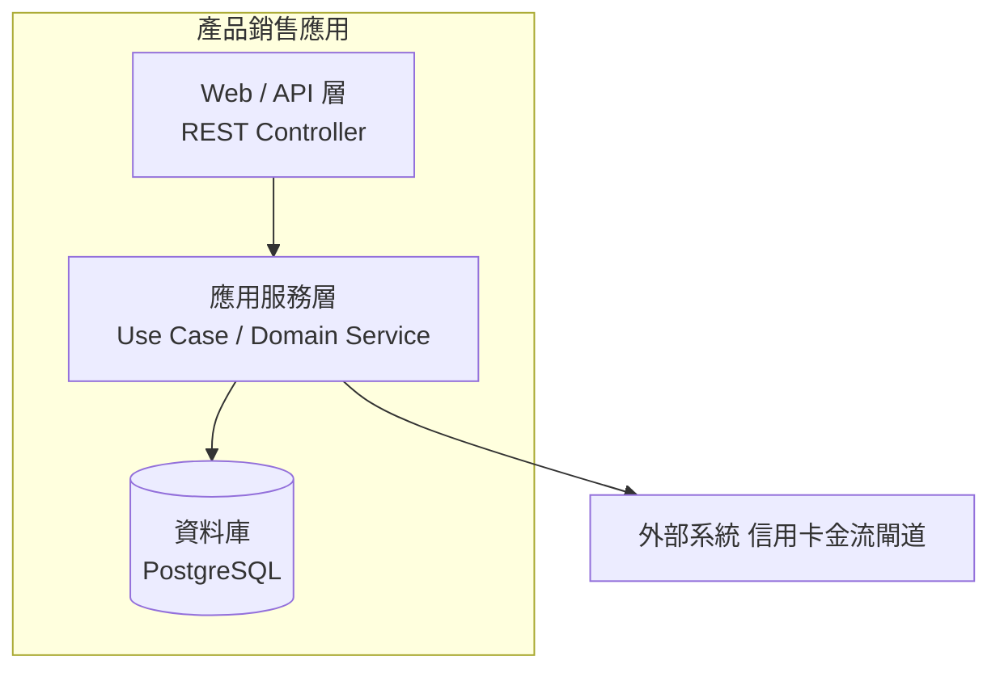

### L3 元件圖(Component)

**說明**:應用服務層內部——**以 bounded context 為元件邊界**(一個 context 一個 Service + 其 Aggregate),context 間僅以 domain event 溝通。

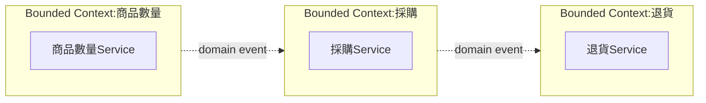

## 5. UML

### 類別圖(Class Diagram)

**說明**:每個 bounded context 的 aggregate 對應一個類別;事件風暴的 🟦 command 直接成為該類別的公開方法(行為即介面)。

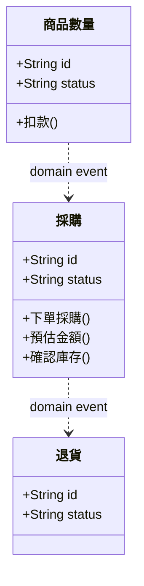

### 循序圖(Sequence Diagram)

**說明**:由事件風暴的 command→event 流逐一還原——actor 發出 command,服務落地後回應 domain event;🟪 policy 以備註標在對應服務上。

#### 商品數量
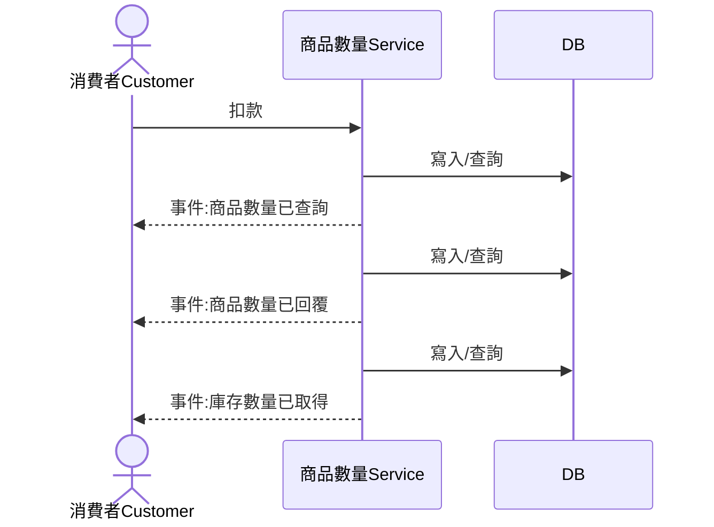

#### 採購
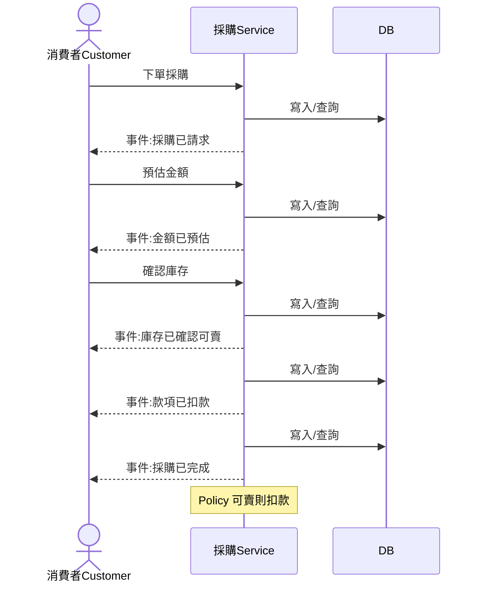

#### 退貨
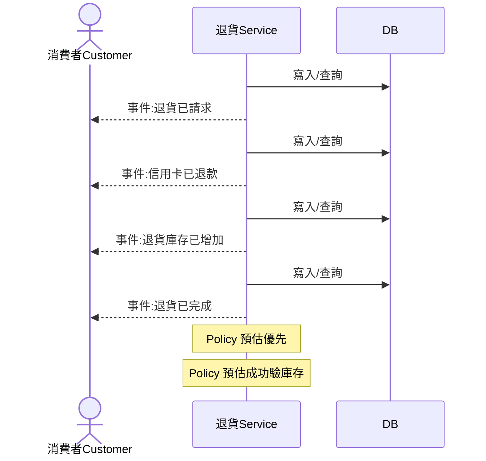

### 狀態圖(State Diagram)

**說明**:aggregate 的生命週期——事件風暴的事件序即狀態轉移序(每個 domain event 代表一次完成的轉移)。

#### 商品數量
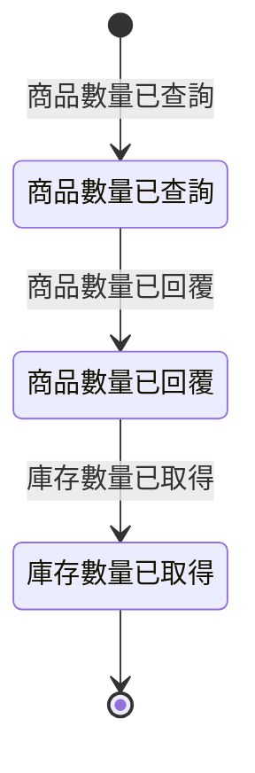

#### 採購
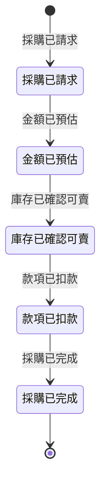

#### 退貨
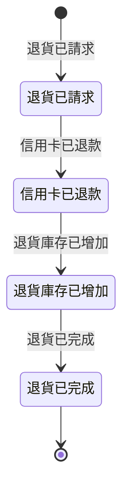

## 6. ER Diagram

**說明**:每個 aggregate 一張資料表(id/name/status/created_at 為通用欄位,細部欄位由開發階段依技術需求補齊);關聯依事件流方向建立。

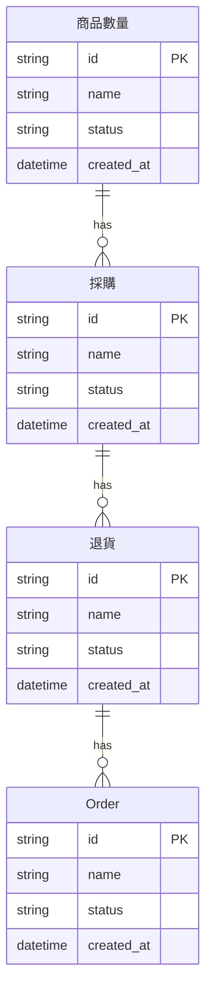

## 7. 測試案例

**說明**:業務層級 Gherkin 出自業務需求文件,是驗收的**最高權威來源**;技術層級情境由測試案例階段從業務 Gherkin 展開(含邊界與負向情境);各 bounded context 的驗收要點由 domain event 反推(每個事件都應可驗證)。

### 業務層級 Gherkin(權威來源)
```gherkin
Feature: 商品目錄管理
  身為平台管理員與顧客
  我們需要一個可靠的商品目錄
  以便管理員能上下架商品，顧客能瀏覽並選購商品

  Background:
    Given 系統中已存在以下商品：
      | 商品名稱   | 售價（TWD） | 狀態 |
      | 無線滑鼠   | 590         | 上架 |
      | 機械鍵盤   | 2,490       | 上架 |
      | 舊款耳機   | 999         | 下架 |
      | 新品音箱   | 3,200       | 草稿 |

  Scenario: 訪客瀏覽商品列表只看到上架商品
    Given 我是一位未登入的訪客
    When 我瀏覽商品列表
    Then 我應該看到以下商品：
      | 商品名稱 | 售價（TWD） |
      | 無線滑鼠 | 590         |
      | 機械鍵盤 | 2,490       |
    And 我不應該看到「舊款耳機」
    And 我不應該看到「新品音箱」

  Scenario: 管理員成功上架新商品
    Given 我是一位已登入的管理員
    When 我新增一個商品，資料如下：
      | 欄位     | 值              |
      | 商品名稱 | 藍牙喇叭        |
      | 售價     | TWD 1,800       |
      | 描述     | 高音質藍牙喇叭  |
    And 我執行「上架」操作
    Then 商品「藍牙喇叭」的狀態應為「上架」
    And 訪客瀏覽商品列表時應能看到「藍牙喇叭」，售價為 TWD 1,800

  Scenario: 管理員無法建立售價為零的商品
    Given 我是一位已登入的管理員
    When 我嘗試新增一個商品，售價為 TWD 0
    Then 系統應拒絕此操作
    And 系統應顯示錯誤訊息「商品售價必須大於 TWD 0」

  Scenario: 管理員下架商品後顧客無法瀏覽
    Given 我是一位已登入的管理員
    And 商品「無線滑鼠」目前狀態為「上架」
    When 我對「無線滑鼠」執行「下架」操作
    Then 商品「無線滑鼠」的狀態應為「下架」
    And 訪客瀏覽商品列表時不應看到「無線滑鼠」
```

```gherkin
Feature: 購物車管理
  身為一位已登入的會員
  我需要一個購物車
  以便在結帳前整理我想購買的商品

  Background:
    Given 我是一位已登入的會員「王小明」
    And 系統中存在以下上架商品：
      | 商品名稱 | 售價（TWD） |
      | 無線滑鼠 | 590         |
      | 機械鍵盤 | 2,490       |
    And 我的購物車目前為空

  Scenario: 會員成功將商品加入購物車
    When 我將「無線滑鼠」加入購物車，數量為 2
    Then 我的購物車應包含：
      | 商品名稱 | 數量 | 小計（TWD） |
      | 無線滑鼠 | 2    | 1,180       |
    And 購物車總金額應為 TWD 1,180

  Scenario: 重複加入相同商品時累加數量
    Given 我的購物車已有「無線滑鼠」1 件
    When 我再次將「無線滑鼠」加入購物車，數量為 1
    Then 我的購物車中「無線滑鼠」的數量應為 2
    And 購物車總金額應為 TWD 1,180

  Scenario: 會員修改購物車商品數量
    Given 我的購物車已有「機械鍵盤」2 件
    When 我將「機械鍵盤」的數量修改為 1
    Then 購物車總金額應為 TWD 2,490

  Scenario: 會員移除購物車中的商品
    Given 我的購物車已有：
      | 商品名稱 | 數量 |
      | 無線滑鼠 | 1    |
      | 機械鍵盤 | 1    |
    When 我移除「無線滑鼠」
    Then 我的購物車應只剩「機械鍵盤」1 件
    And 購物車總金額應為 TWD 2,490

  Scenario: 購物車商品數量不可設為零
    Given 我的購物車已有「無線滑鼠」1 件
    When 我嘗試將「無線滑鼠」的數量修改為 0
    Then 系統應拒絕此操作
    And 系統應顯示錯誤訊息「商品數量最小值為 1」
```

```gherkin
Feature: 訂單建立
  身為一位已登入的會員
  我需要能夠將購物車轉換為訂單
  以便完成購買並鎖定當下的商品售價

  Background:
    Given 我是一位已登入的會員「李大華」
    And 我的購物車包含：
      | 商品名稱 | 數量 | 單價（TWD） |
      | 無線滑鼠 | 2    | 590         |
      | 機械鍵盤 | 1    | 2,490       |

  Scenario: 會員成功建立訂單
    When 我確認結帳並建立訂單
    Then 系統應建立一筆新訂單
    And 訂單狀態應為「待付款」
    And 訂單應包含以下商品快照：
      | 商品名稱 | 數量 | 快照單價（TWD） | 小計（TWD） |
      | 無線滑鼠 | 2    | 590             | 1,180       |
      | 機械鍵盤 | 1    | 2,490           | 2,490       |
    And 訂單總金額應為 TWD 3,670
    And 系統應產生唯一的訂單編號

  Scenario: 訂單建立後商品售價異動不影響訂單金額
    Given 我已成功建立一筆訂單，訂單總金額為 TWD 3,670
    When 管理員將「無線滑鼠」的售價修改為 TWD 790
    Then 我的訂單總金額仍應為 TWD 3,670
    And 訂單中「無線滑鼠」的快照單價仍應為 TWD 590

  Scenario: 會員無法查看他人訂單
    Given 系統中存在會員「陳小美」的訂單
    When 我嘗試查詢「陳小美」的訂單
    Then 系統應拒絕此操作
    And 系統應顯示錯誤訊息「無權限存取此訂單」
```

```gherkin
Feature: 訂單取消
  身為一位已登入的會員
  我需要能夠取消尚未付款的訂單
  以便在改變心意時不被強制完成購買

  Background:
    Given 我是一位已登入的會員「李大華」

  Scenario: 會員成功取消待付款訂單
    Given 我有一筆狀態為「待付款」的訂單，訂單編號為「ORD-20250101-001」
    When 我取消訂單「ORD-20250101-001」
    Then 訂單「ORD-20250101-001」的狀態應變更為「已取消」

  Scenario: 會員無法取消已付款訂單
    Given 我有一筆狀態為「已付款」的訂單，訂單編號為「ORD-20250101-002」
    When 我嘗試取消訂單「ORD-20250101-002」
    Then 系統應拒絕此操作
    And 系統應顯示錯誤訊息「已付款訂單無法取消」
    And 訂單「ORD-20250101-002」的狀態應維持「已付款」
```

```gherkin
Feature: 付款處理
  身為一位已登入的會員
  我需要能夠對待付款訂單進行付款
  以便完成購買流程

  Background:
    Given 我是一位已登入的會員「李大華」
    And 我有一筆狀態為「待付款」的訂單：
      | 訂單編號          | 應付金額（TWD） |
      | ORD-20250101-001  | 3,670           |

  Scenario: 會員成功完成付款
    When 我對訂單「ORD-20250101-001」進行付款，金額為 TWD 3,670
    Then 付款應成功
    And 訂單「ORD-20250101-001」的狀態應變更為「已付款」
    And 我應收到付款成功的通知（通知管道待 Q10 確認）

  Scenario: 付款金額不符時系統拒絕付款
    When 我對訂單「ORD-20250101-001」進行付款，金額為 TWD 3,000
    Then 系統應拒絕此付款
    And 系統應顯示錯誤訊息「付款金額與訂單應付金額不符」
    And 訂單「ORD-20250101-001」的狀態應維持「待付款」

  Scenario: 付款服務異常時 SAGA 補償交易自動執行
    Given 付款服務在處理過程中發生異常
    When 我對訂單「ORD-20250101-001」進行付款
    Then SAGA 補償交易應自動執行
    And 訂單「ORD-20250101-001」的狀態應回復為「待付款」
    And 系統應記錄補償交易執行日誌
    And 若補償交易執行失敗，系統應觸發人工介入告警
```

```gherkin
Feature: 訂單狀態變更通知
  身為一位已登入的會員
  我需要在訂單狀態變更時收到通知
  以便即時掌握訂單進度

  # 通知管道待 Q10 確認，以下以「通知」泛稱

  Scenario Outline: 訂單狀態變更時觸發通知
    Given 我是一位已登入的會員
    And 我有一筆訂單「<訂單編號>」
    When 訂單狀態變更為「<新狀態>」
    Then 我應收到一則通知
    And 通知內容應包含訂單編號「<訂單編號>」
    And 通知內容應包含狀態「<新狀態>」
    And 通知內容應包含相關金額（TWD）

    Examples:
      | 訂單編號          | 新狀態   |
      | ORD-20250101-001  | 待付款   |
      | ORD-20250101-001  | 已付款   |
      | ORD-20250101-001  | 已取消   |
      | ORD-20250101-001  | 付款失敗 |
```

### 技術層級測試情境(出自測試案例階段)
- TC-CAT-001 — Unauthenticated guest retrieves only published products
- TC-CAT-002 — Authenticated member retrieves only published products
- TC-CAT-003 — Pagination returns correct page size and metadata
- TC-CAT-004 — Last page returns remaining products
- TC-CAT-005 — Request with out-of-range page number returns empty list
- TC-CAT-006 — Guest retrieves full details of a published product
- TC-CAT-007 — Request for an unpublished product returns 404
- TC-CAT-008 — Request for a draft product returns 404
- TC-CAT-009 — Request for a non-existent product ID returns 404
- TC-CAT-010 — Request with non-numeric product ID returns 400
- TC-CAT-011 — Admin creates a product and it defaults to DRAFT status
- TC-CAT-012 — Admin publishes a DRAFT product successfully
- TC-CAT-013 — Admin creates a product with minimum valid price (TWD 1)
- TC-CAT-014 — Publishing an already PUBLISHED product returns appropriate response
- TC-CAT-015 — Publishing a non-existent product returns 404
- TC-CAT-016 — Admin cannot create a product with price TWD 0
- TC-CAT-017 — Admin cannot create a product with negative price
- TC-CAT-018 — Admin cannot create a product without required field: name
- TC-CAT-019 — Admin cannot create a product without required field: description
- TC-CAT-020 — Unauthenticated client cannot create a product
- TC-CAT-020B — OPEN: Admin cannot create a product with a duplicate name
- TC-CAT-021 — Admin unpublishes a published product and it disappears from public listing
- TC-CAT-022 — Unpublishing an already UNPUBLISHED product returns conflict
- TC-CAT-023 — Unpublishing a DRAFT product returns conflict
- TC-CAT-024 — Unauthenticated client cannot unpublish a product
- TC-CAT-025 — Admin cannot unpublish a non-existent product
- TC-CAT-025B — OPEN: Admin attempts to unpublish a product with active PENDING_PAYMENT orders
- TC-CART-001 — Member adds a product to an empty cart
- TC-CART-002 — Member adds the same product twice and quantities accumulate
- TC-CART-003 — Member adds a product with quantity exactly 1 (minimum boundary)
- TC-CART-004 — Member adds two different products and total is sum of subtotals
- TC-CART-005 — Member cannot add a product with quantity 0
- TC-CART-006 — Unauthenticated client cannot add items to cart
- TC-CART-007 — Member updates item quantity and total recalculates
- TC-CART-008 — Member removes a single item from cart
- TC-CART-009 — Member clears entire cart
- TC-CART-010 — Member updates item quantity to exactly 1 (minimum boundary)
- TC-CART-011 — Member removes the only item in cart results in empty cart
- TC-CART-012 — Member clears an already empty cart returns success
- TC-CART-013 — Member cannot set item quantity to 0

### 各 Bounded Context 驗收要點(由 domain event 反推)

- **商品數量**:「商品數量已查詢」可被觀測/查詢、「商品數量已回覆」可被觀測/查詢、「庫存數量已取得」可被觀測/查詢
- **採購**:「採購已請求」可被觀測/查詢、「金額已預估」可被觀測/查詢、「庫存已確認可賣」可被觀測/查詢、「款項已扣款」可被觀測/查詢、「採購已完成」可被觀測/查詢
- **退貨**:「退貨已請求」可被觀測/查詢、「信用卡已退款」可被觀測/查詢、「退貨庫存已增加」可被觀測/查詢、「退貨已完成」可被觀測/查詢

## 8. 建置與執行

產出的後端為三層式 Java(Controller / Service / Repository)+ 單元測試:

```bash
mvn test        # 完整建置 + 測試
```

離線驗證(無相依,只需 JDK):

```bash
javac -d out $(find src/main/java verify -name '*.java')
java -cp out com.example.app.Verification
```

## 9. 文件與產出物
- [業務需求](docs/business-req.md)(含事件風暴分析原文)
- [技術需求](docs/tech-req.md)
- [工項規劃 WBS](docs/wbs.md)
- [測試案例](docs/test-cases.md)
- [程式碼審查報告](docs/code-review.md)
- 原始碼:`src/`(Maven 專案)· 離線驗證:`verify/`
